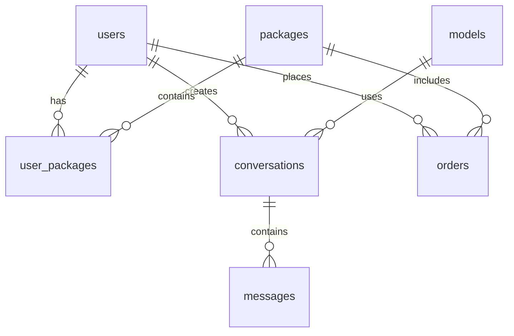

# CyberMind Π 数据库设计文档

## 1. 数据库概述

本项目使用PostgreSQL 14.8.0作为主数据库，Redis 7.0.6作为缓存数据库。主要包含用户管理、模型配置、对话管理、订单管理等相关表结构。

### 1.1 数据库配置

#### PostgreSQL配置
- 版本：14.8.0
- 主机：cybermind-postgresql.ns-han88ija.svc
- 端口：5432
- 用户名：postgres
- 密码：wkzhx7jn
- 资源限制：
  - CPU: 1 Core
  - 内存: 1 Gi
  - 磁盘: 3 Gi

#### Redis配置
- 版本：7.0.6
- 主机：cybermindredis-redis.ns-han88ija.svc
- 端口：6379
- 密码：mqjfcd8x
- 资源限制：
  - CPU: 1 Core
  - 内存: 1 Gi
  - 磁盘: 3 Gi

## 2. 表结构设计

### 2.1 用户相关表

#### users（用户表）
| 字段名 | 类型 | 必填 | 默认值 | 说明 |
|-------|------|------|--------|------|
| id | BIGSERIAL | 是 | - | 主键 |
| username | VARCHAR(50) | 是 | - | 用户名 |
| email | VARCHAR(100) | 是 | - | 邮箱，唯一 |
| password_hash | VARCHAR(255) | 是 | - | 密码哈希 |
| avatar_url | VARCHAR(255) | 否 | NULL | 头像URL |
| phone | VARCHAR(20) | 否 | NULL | 手机号 |
| status | SMALLINT | 是 | 1 | 状态：1正常，0禁用 |
| role | SMALLINT | 是 | 0 | 角色：0普通用户，1管理员 |
| points | INT | 是 | 0 | 当前积分 |
| created_at | TIMESTAMP | 是 | CURRENT_TIMESTAMP | 创建时间 |
| updated_at | TIMESTAMP | 是 | CURRENT_TIMESTAMP | 更新时间 |

#### user_packages（用户套餐表）
| 字段名 | 类型 | 必填 | 默认值 | 说明 |
|-------|------|------|--------|------|
| id | BIGSERIAL | 是 | - | 主键 |
| user_id | BIGINT | 是 | - | 用户ID，外键 |
| package_id | BIGINT | 是 | - | 套餐ID，外键 |
| points_remaining | INT | 是 | - | 剩余积分 |
| start_time | TIMESTAMP | 是 | - | 开始时间 |
| end_time | TIMESTAMP | 是 | - | 结束时间 |
| status | SMALLINT | 是 | 1 | 状态：1有效，0过期 |
| created_at | TIMESTAMP | 是 | CURRENT_TIMESTAMP | 创建时间 |

### 2.2 AI模型相关表

#### models（模型配置表）
| 字段名 | 类型 | 必填 | 默认值 | 说明 |
|-------|------|------|--------|------|
| id | BIGSERIAL | 是 | - | 主键 |
| name | VARCHAR(50) | 是 | - | 模型名称 |
| provider | VARCHAR(50) | 是 | - | 提供商 |
| api_type | VARCHAR(20) | 是 | - | API类型 |
| points_per_request | INT | 是 | - | 每次请求消耗积分 |
| config | JSONB | 否 | NULL | 模型配置参数 |
| status | SMALLINT | 是 | 1 | 状态：1启用，0禁用 |
| created_at | TIMESTAMP | 是 | CURRENT_TIMESTAMP | 创建时间 |
| updated_at | TIMESTAMP | 是 | CURRENT_TIMESTAMP | 更新时间 |

### 2.3 对话相关表

#### conversations（对话记录表）
| 字段名 | 类型 | 必填 | 默认值 | 说明 |
|-------|------|------|--------|------|
| id | BIGSERIAL | 是 | - | 主键 |
| user_id | BIGINT | 是 | - | 用户ID，外键 |
| model_id | BIGINT | 是 | - | 模型ID，外键 |
| title | VARCHAR(255) | 否 | NULL | 对话标题 |
| points_consumed | INT | 是 | - | 消耗的积分 |
| created_at | TIMESTAMP | 是 | CURRENT_TIMESTAMP | 创建时间 |

#### messages（消息表）
| 字段名 | 类型 | 必填 | 默认值 | 说明 |
|-------|------|------|--------|------|
| id | BIGSERIAL | 是 | - | 主键 |
| conversation_id | BIGINT | 是 | - | 对话ID，外键 |
| role | VARCHAR(20) | 是 | - | 角色：system/user/assistant |
| content | TEXT | 是 | - | 消息内容 |
| tokens_count | INT | 否 | NULL | token数量 |
| created_at | TIMESTAMP | 是 | CURRENT_TIMESTAMP | 创建时间 |

### 2.4 计费相关表

#### packages（套餐表）
| 字段名 | 类型 | 必填 | 默认值 | 说明 |
|-------|------|------|--------|------|
| id | BIGSERIAL | 是 | - | 主键 |
| name | VARCHAR(50) | 是 | - | 套餐名称 |
| type | SMALLINT | 是 | - | 类型：1体验，2日卡，3周卡，4月卡 |
| price | DECIMAL(10,2) | 是 | - | 价格 |
| total_points | INT | 是 | - | 总积分 |
| daily_points | INT | 否 | NULL | 每日可用积分 |
| duration_days | INT | 是 | - | 有效期天数 |
| status | SMALLINT | 是 | 1 | 状态：1启用，0禁用 |
| created_at | TIMESTAMP | 是 | CURRENT_TIMESTAMP | 创建时间 |

#### orders（订单表）
| 字段名 | 类型 | 必填 | 默认值 | 说明 |
|-------|------|------|--------|------|
| id | BIGSERIAL | 是 | - | 主键 |
| user_id | BIGINT | 是 | - | 用户ID，外键 |
| package_id | BIGINT | 是 | - | 套餐ID，外键 |
| order_no | VARCHAR(50) | 是 | - | 订单号，唯一 |
| amount | DECIMAL(10,2) | 是 | - | 订单金额 |
| status | SMALLINT | 是 | 0 | 状态：0未支付，1已支付，2已取消 |
| payment_time | TIMESTAMP | 否 | NULL | 支付时间 |
| created_at | TIMESTAMP | 是 | CURRENT_TIMESTAMP | 创建时间 |

## 3. 索引设计

### 3.1 用户相关索引
```sql
-- users表索引
CREATE UNIQUE INDEX idx_users_email ON users(email);
CREATE INDEX idx_users_status ON users(status);

-- user_packages表索引
CREATE INDEX idx_user_packages_user_id ON user_packages(user_id);
CREATE INDEX idx_user_packages_status ON user_packages(status);
```

### 3.2 对话相关索引
```sql
-- conversations表索引
CREATE INDEX idx_conversations_user_id ON conversations(user_id);
CREATE INDEX idx_conversations_created_at ON conversations(created_at);

-- messages表索引
CREATE INDEX idx_messages_conversation_id ON messages(conversation_id);
CREATE INDEX idx_messages_created_at ON messages(created_at);
```

### 3.3 订单相关索引
```sql
-- orders表索引
CREATE UNIQUE INDEX idx_orders_order_no ON orders(order_no);
CREATE INDEX idx_orders_user_id ON orders(user_id);
CREATE INDEX idx_orders_status ON orders(status);
CREATE INDEX idx_orders_created_at ON orders(created_at);
```

## 4. 数据库关系图



## 5. 缓存设计

### 5.1 Redis缓存键设计
| 键名 | 类型 | 说明 | 过期时间 |
|------|------|------|----------|
| user:{id}:info | Hash | 用户基本信息 | 1小时 |
| user:{id}:points | String | 用户积分 | 5分钟 |
| model:{id}:config | Hash | 模型配置 | 30分钟 |
| package:{id}:info | Hash | 套餐信息 | 1小时 |
| conversation:{id}:messages | List | 对话消息 | 24小时 |

### 5.2 缓存更新策略
- 用户信息：更新数据库后删除缓存
- 积分信息：双写一致性（先更新数据库，后更新缓存）
- 模型配置：定时同步更新
- 套餐信息：更新数据库后删除缓存
- 对话消息：实时写入，异步持久化 